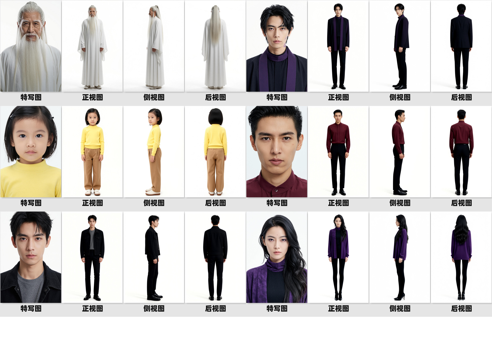
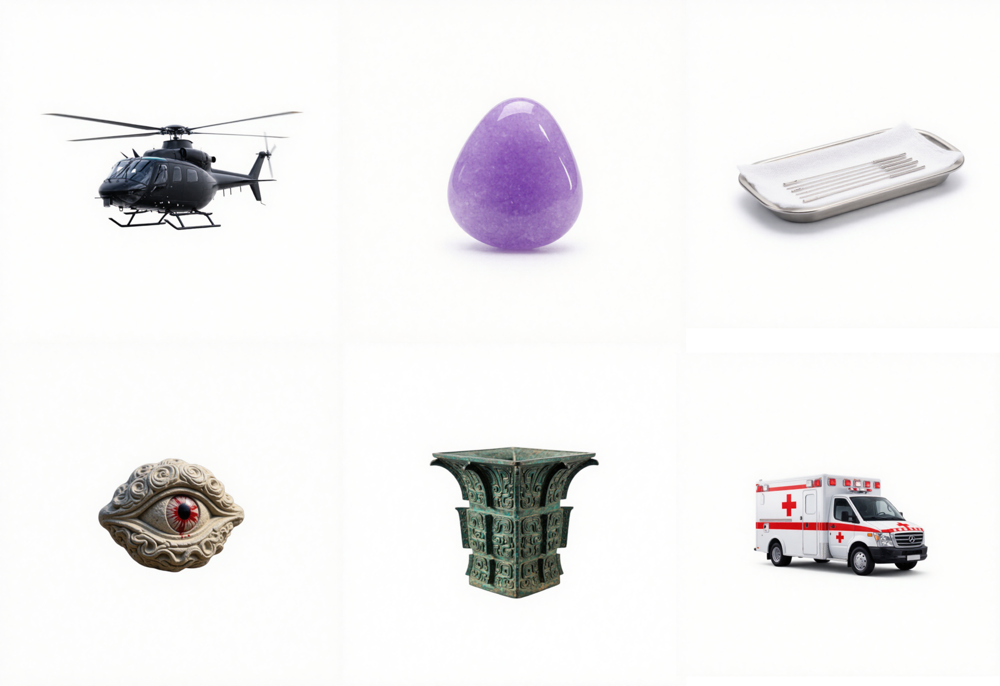

# AI Short Drama Asset Pipeline

> 剧本一键输入 → 人物/场景/道具资产自动生成 → 三层质检 → 自动返工 → HTML报告 → 假设检验对比

全链路自动化的AI短剧资产生成与质量评估管线，支持RunningHub云端ComfyUI工作流调用，内置CUDA GPU加速质检。

## ✨ 核心特性

- 🎬 **全链路自动化**：剧本一键输入，自动完成人物/场景/道具三类资产的解析、生成、质检、返工与报告，无需人工干预
- 👤 **多视角一致性**：基于Qwen-Image-Edit-2511的指令驱动能力，生成同角色正面/侧面/背面多视角统一形象
- 🎨 **双风格切换**：支持亚洲/欧美两套美术风格一键切换，适配都市、古风、悬疑等不同题材剧本
- ⚡ **批量并发调度**：5路异步并发+2小时超时保护，单集剧本资产生成效率提升约70%
- 🔍 **三层质量质检**：IQA画质(BRISQUE/模糊) + CLIP语义对齐 + 专项检测(人体关键点/OCR/场景一致性)，CUDA GPU加速
- 🔄 **自动返工机制**：自动检测人体不完整图片，找到源提示词重新提交生成，覆盖不合格图片并记录返工日志
- 📊 **可视化报告**：人物/道具/场景独立报告 + 综合报告 + 假设检验对比报告，含指标说明和动态优化建议
- 📈 **假设检验对比**：基于曼-惠特尼U检验(Mann-Whitney U)，将新剧本资产与基准值对比，判断批次质量是否达标
- 📦 **标准化交付**：自动按命名集分类归档，资产与剧本实体一一对应（如`叶凡的玉佩.jpg`），可直接对接后期剪辑管线

## 📂 模块架构（6个核心模块）

| 模块 | 文件 | 职责 |
|------|------|------|
| 启动器 | `launcher.py` | 一键运行全流程：剧本→生成→质检→返工→报告→假设检验 |
| 资产生成 | `generation.py` | 剧本解析→提示词生成→RunningHub API批量生成图片→合并重命名 |
| 三层质检 | `core_eval.py` | IQA画质 + CLIP语义对齐 + 专项检测(人体关键点/OCR/场景一致性) + 统计学模块 |
| 自动返工 | `rework.py` | 检测人体不完整→找到源提示词→重新提交API生成→覆盖不合格图→记录返工日志 |
| 报告生成 | `reporting.py` | 人物/道具/场景独立报告 + 综合报告，含指标说明和动态结论 |
| 统计分析 | `analysis.py` | 基准值管理 + 曼-惠特尼U检验假设对比 + 假设检验报告生成 |

## 📁 目录结构

```
ai-short-drama-pipeline/
├── launcher.py              # 启动器（全流程入口）
├── generation.py            # 资产生成模块
├── core_eval.py             # 三层质检模块
├── rework.py                # 自动返工模块
├── reporting.py             # 报告生成模块
├── analysis.py              # 统计分析/假设检验模块
├── workflows/               # ComfyUI工作流JSON
│   ├── prompt_workflow.json # 提示词生成工作流
│   ├── char_workflow.json   # 人物生成工作流
│   ├── prop_workflow.json   # 道具生成工作流
│   └── scene_workflow.json  # 场景生成工作流
├── examples/                # 效果示例图
│   ├── char_demo.png
│   ├── scene_demo.png
│   └── prop_demo.png
├── 剧本/                     # 剧本文件（.txt）
├── API密钥.txt               # RunningHub API密钥（不提交到Git）
├── README.md
├── .gitignore
└── LICENSE
```

## 🚀 快速开始

### 1. 安装依赖

```bash
pip install numpy pandas scipy Pillow opencv-python transformers torch brisque ultralytics rapidocr-onnxruntime imagehash insightface
```

> **GPU加速**：如需CUDA加速，安装对应CUDA版本的PyTorch，并将torch库路径通过`PYTHONPATH`环境变量指定。

### 2. 配置API密钥

在项目根目录创建`API密钥.txt`，写入RunningHub API密钥。

### 3. 运行全流程

```bash
# 交互式（选择剧本）
python launcher.py

# 命令行参数（指定剧本和输出目录）
python launcher.py 剧本/无法言说的秘密_第一集.txt RunningHub_Outputs_输出目录
```

### 4. 单独运行各模块

```bash
# 仅资产生成
python generation.py 剧本/xxx.txt 输出目录 1

# 仅质检（需先生成资产）
set EVAL_OUTPUT_DIR=输出目录
python core_eval.py

# 仅生成报告
set EVAL_OUTPUT_DIR=输出目录
python reporting.py
```

## 🔍 质检指标说明

### 通用指标（所有资产）
| 指标 | 说明 | 合格标准 |
|------|------|----------|
| `brisque_score` | 无参考画质评分（越低越好） | - |
| `blur_score` | 拉普拉斯模糊检测（越高越清晰） | - |
| `iqa_pass` | 画质是否合格 | - |
| `clip_score` | CLIP图文匹配度 | ≥0.26 |
| `clip_pass` | CLIP语义是否合格 | - |

### 人物专属
| 指标 | 说明 | 合格标准 |
|------|------|----------|
| `keypoint_count` | YOLOv8-pose人体关键点数量 | =17（完整） |
| `integrity_pass` | 人体完整性是否合格 | - |
| `intra_clip_consistency` | 1×4横排多视角CLIP一致性 | ≥0.70 |
| `intra_face_consistency` | InsightFace人脸一致性（需下载模型） | - |

### 道具专属
| 指标 | 说明 | 合格标准 |
|------|------|----------|
| `has_text` | 是否检测到文字 | - |
| `detected_text` | OCR识别的文字内容 | - |
| `text_lang_pass` | 文字语种校验（亚洲风格→中文为主） | - |
| `text_keyword_pass` | 关键词校验（包含核心关键词） | - |
| `text_pass` | 文字综合是否合格 | - |

### 场景专属
| 指标 | 说明 | 合格标准 |
|------|------|----------|
| `group_consistency` | 四宫格2×2多视图CLIP一致性 | ≥0.65 |
| `scene_color_consistency` | HSV直方图颜色一致性 | ≥0.70 |

## 📈 假设检验

基于曼-惠特尼U检验(Mann-Whitney U test, 双侧, α=0.05)，将新剧本资产的各项指标与基准值对比：
- **p > 0.05**：新批次与基准无显著差异，质量达标
- **p ≤ 0.05**：新批次与基准存在显著差异，需关注

基准值目录默认为`RunningHub_Outputs/`，可在`launcher.py`中配置`BASELINE_DIR`。

## ⚙️ 环境变量

| 变量 | 说明 |
|------|------|
| `EVAL_OUTPUT_DIR` | 质检/报告的输出目录 |
| `PYTHONPATH` | GPU torch库路径（如`./pylibs`） |
| `HF_ENDPOINT` | HuggingFace镜像（国内加速，如`https://hf-mirror.com`） |

## 📸 效果示例

### 人物多视角一致性生成
基于Qwen-Image-Edit-2511，输入同一角色参考图，自动生成正面、侧面、背面三视图，保持身份特征与画风统一。



### 场景生成
支持新中式/欧美双风格场景生成，并可根据剧本场景描述控制日夜光影变化。


### 道具生成
标准化白底45°视角道具图，可直接用于后期合成与排版。



## 📄 License

MIT License
